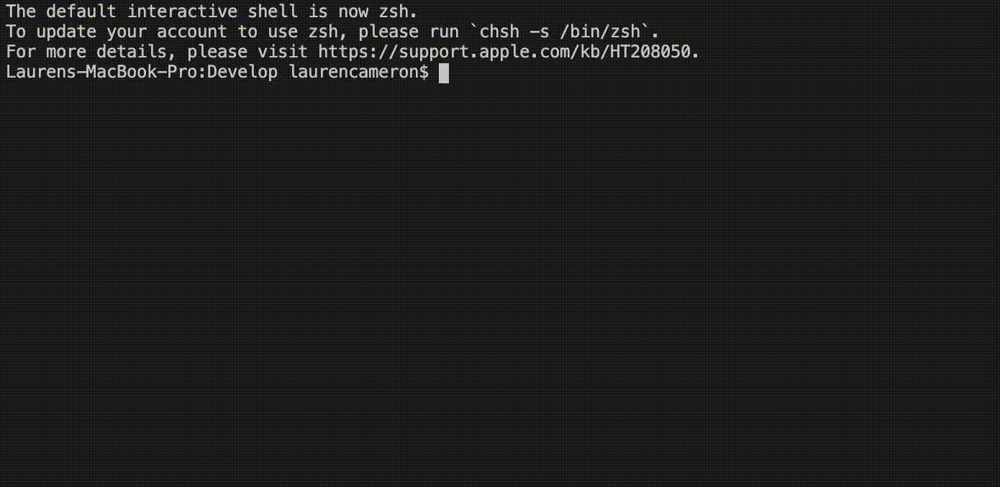
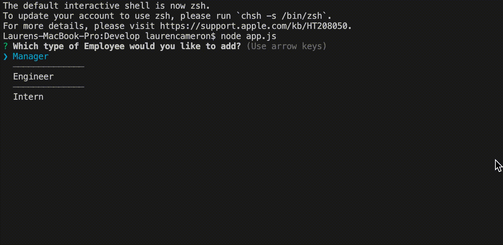
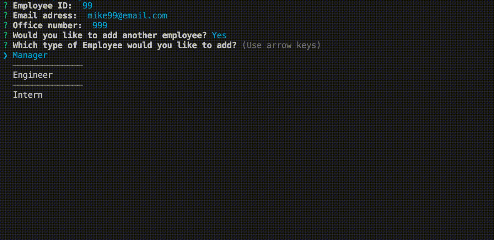
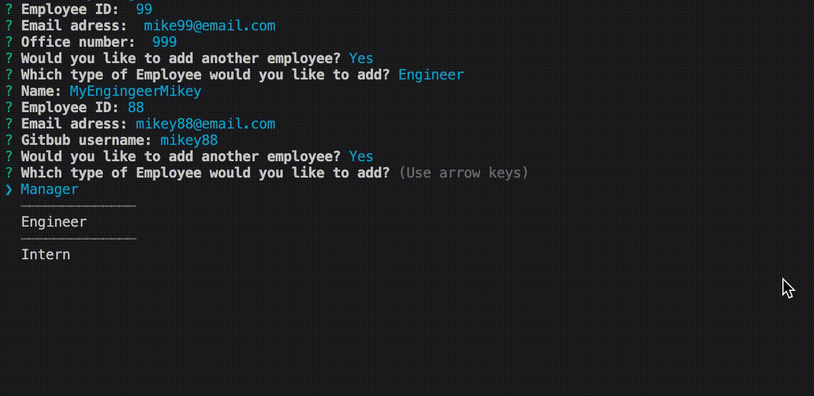
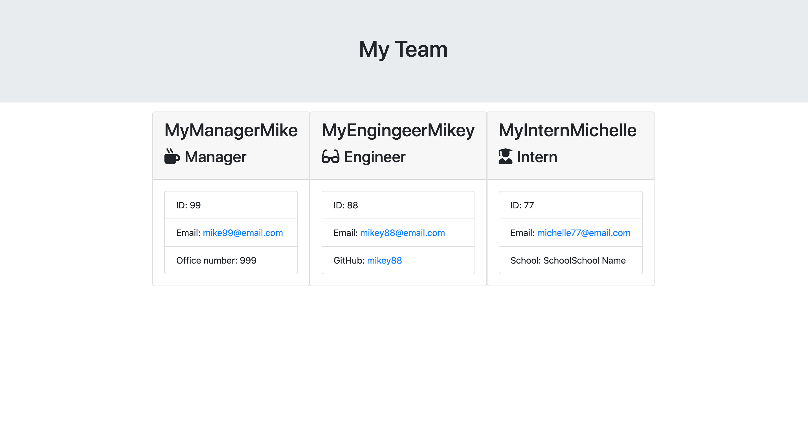
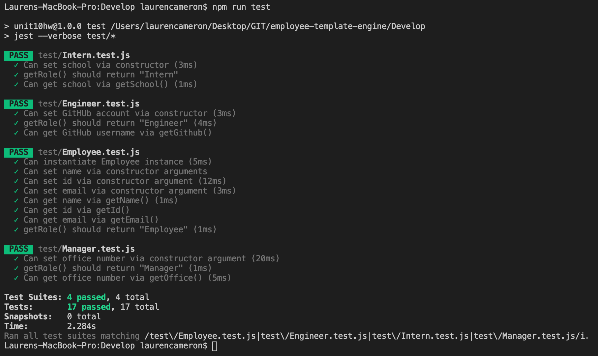

# Team Profile Generator

This is a simple to use command line application, which prompts the user to input data about their employee's and then generates a HTML document with a styled list of all inputs and thier information. 


## User Story 
  
```
As a manager
I want to generate a webpage that displays my team's basic info
so that I have quick access to emails and GitHub profiles
```


## How it works 

 The application will prompt the user for information about the team manager and then information about the team members. The user can input any number of team members, and they may be a mix of managers, engineers and interns. 

 This application uses the NPM package Inquirer to prompt the user. 

 There are three different types of team members you can create profiles for: managers, emgineers, and interns. 

 Manager profile will house name, employee ID, office number and email.

 Engiier profile will house name, employee ID, emial, and github username.

 Intern porfile will house name, employee ID, email, and school they are attending.


 ### Inintailze the app by navigating to the app and running `node app.js` in your terminal 



### Create a Manager 



### Create a Engineer 



### Create a Inertnn 



## Output 

Once you're finished inputting all your employees, the application will automatically plug in the information into a stylized html file. Navigate the the `output` folder and open `team.html` to view the finished product!




## Testing

Testing can be done my running `npm run test`

Currently all tests are passing 



